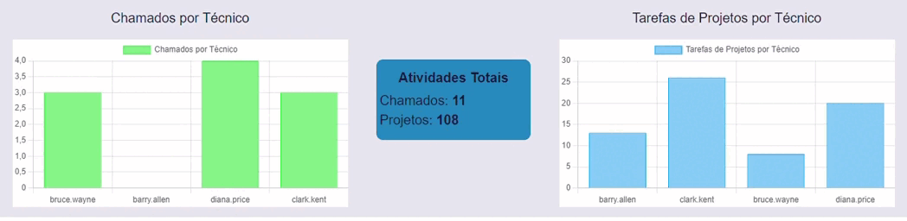
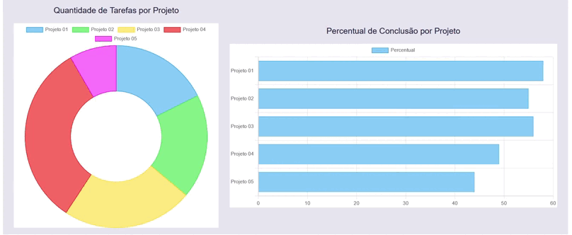
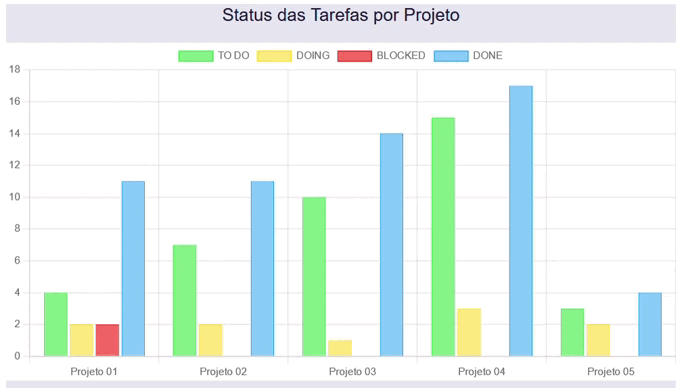
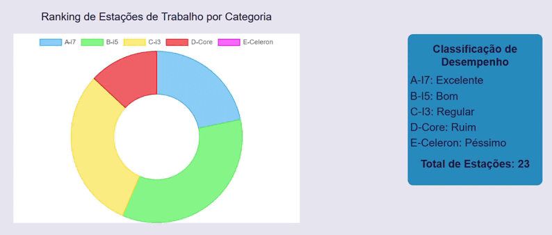
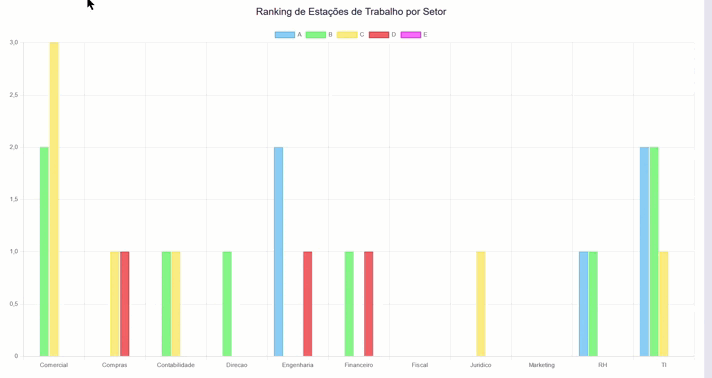
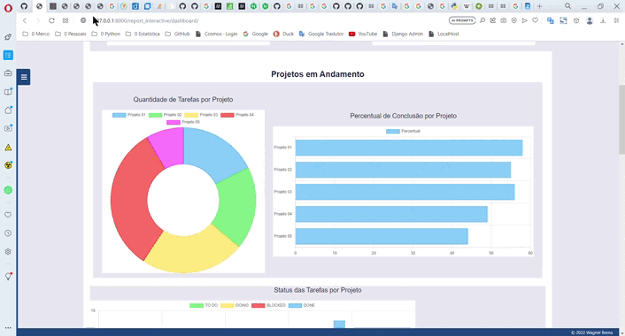

# Sistema de Help Desk, Projetos Kanban e Inventário de TI em Django

## 💡 Objetivo:
Através do Django criar um sistema de help desk, gerência de projetos com quadro Kanban e inventário de TI, fornecendo dashboards interativos dos dados com o JavaScript.

## 🛠 Tecnologias:

- [Python](https://www.python.org)
- [JavaScript](https://developer.mozilla.org/pt-BR/docs/Web/JavaScript)
- [Django](https://www.djangoproject.com/)
- [Django Rest](https://www.django-rest-framework.org/)
- [PostgreSQL](https://www.postgresql.org/)
- [SQLite](https://www.sqlite.org/index.html)
- [Python-Decouple](https://pypi.org/project/python-decouple/)
- [Matplotlib](https://matplotlib.org)
- [Chart.js](https://www.chartjs.org/docs/latest/)
- [Pandas](https://pandas.pydata.org)
- [Seaborn](https://seaborn.pydata.org)
- [OpenPyXL](https://openpyxl.readthedocs.io/en/stable/)
- [Bootstrap](https://getbootstrap.com)
- [Font Awesome](https://fontawesome.com)
- [Batch](https://pt.wikipedia.org/wiki/Batch)
- [Gunicorn](https://pypi.org/project/gunicorn/)
- [Nginx](https://nginx.org)

## ⚙️ Serviço WEB:
O sistema está setado para acesso on premise, pois é acessado apenas dentro da rede local, sendo configurado em uma máquina virtual rodando o SO Linux Ubuntu, o acesso WEB é provido utilizando o Gunicorn e Nginx.

## 🎲 Banco de Dados:
O banco de dados escolhido é o PostgreSQL, caso a URL do mesmo não esteja configurada nas variáveis de ambiente, o sistema irá usar como padrão o SQLite na raiz do projeto.
### Diagrama de Entidade e Relacionamento do Banco:

## ☑️ Menu Lateral:
Na lateral esquerda, através de um ícone de um quadrado azul com três traços, é possível acessar um menu com os atalhos mais utilizados, este menu foi feito em o JS com CSS.

## 📃 Paginação e Filtros:
Paginação e filtros foram inseridos em todas páginas que podem vir a conter uma grande quantidade de dados.
Os filtros em geral são por busca de palavras chaves ou categorias.

## 📋 Kanban:
No quadro Kanban as tarefas forma inseridas em formato de postits coloridos sendo divididas em quatro fileiras "TO DO", "DOING", "BLOCKED", "DONE" com as respectivas cores verde, amarelo, vermelho e azul.

Na lateral de cada postit existe três ícones, uma seta para passar a tarefa para o próximo status, uma pasta aberta para editar a tarefa e uma lixeira para excluir a mesma.

É possível filtrar as tarefas pelo título, dono da tarefa e prioridade.
Novas tarefas podem ser adicionadas pelo ícone de sinal positivo no canto superior esquerdo.

## 🤝 Help Desk:
O sistema de help desk pode ser utilizado tanto na área de infraestrutura como para área de desenvolvimento para suporte ao sistema, o usuário comum possui um acesso limitado, que só permite controlar, visualizar e abrir seus próprios chamados, os recursos mais avançados só são permitidos aos usuários inseridos na tabela de área restrita.

Na área do atendente é possível visualizar a fila geral de chamados, ou apenas os chamados que estão atribuídos ao atendente logado o qual pode inserir detalhes sobre o atendimento ou tentativas de contato na lateral direita, os status dos chamados são "Aguardando Atendimento", "Em Andamento", "Pendente" e "Concluído".

### 📧 Envio de E-mail:
O envio de e-mails sobre aviso de abertura de chamado e atualizações no atendimento, pode ser ativado ou desativado por intermédio de uma varíavel de ambiente, que pode ser setada com True para Habilitar ou False para desabilitar.

## 📝 Inventário TI:
Inventário de estações de trabalho, servidores e switches.

O módulo inventário utiliza um processo **ETL** que se alimenta de dados extraídos de um script em linguagem batch rodando na inicialização das estações de trabalho através do servidor de domínio, o qual gera um arquivo de texto para cada máquina com as informações de hardware, software e usuários logado.

Este arquivo é processado, realizando a limpeza dos dados o qual gera uma planilha em excel com a compilação dos dados, bem como estabece um ranking para as estações de trabalho conforme o modelo e geração do processador, indo do A o mais alto nível ao D o mais baixo.

A Planilha gerada serve tanto para servir como base inicial dos dados a serem lançados no banco de dados como para comparação periódica de possíveis alterações.

## 📊 Dashboard:
O projeto foi iniciado utilizando gráficos de apoio da biblioteca Matplotlib, no entanto no dashboard principal é utilizada a biblioteca Chart.js para proporcionar maior interatividade com os gráficos, os quais permitem marcar ou desmarcar itens para uma melhor comparação dos dados, bem como fornecem mais informações ao passar o mouse sobre os itens.

#### Gráficos Atendimentos:
O gráfico em barras mostra o total de atendimentos de chamados e tarefas de projeto por técnico.

#### Gráficos Projetos:
O gráficos de rosca com a quantidade de tarefas por projeto, permitindo comparar a dimensão de cada projeto. 

O gráfico de barras horizontal exibe o percentual de conclusão das tarefas do projeto. 

O gráfico de barras vertical possui quatro colunas para cada projeto mostrando a quantidade de tarefas para cada status das tarefas.

Segue exemplo desmarcando projetos e status para comparar apenas os itens desejados:

#### Gráficos Ranking de Estações de Trabalho:
O gráfico de rosca permite comparar a quantidade total de estações de trabalho conforme sua designação no ranking.

O gráfico em barras vertical exibe para cada setor as respectivas colunas da quantidade de máquinas em cada ranking no setor.

## 🔎 Rotas:
URL de Acesso: http://127.0.0.1:8000/

### 🚩 Gerais:
| Rota            | Descrição              |
|-----------------|------------------------|
| /admin          | Administração do Django|
| /login          | Login                  |
| /changepassword | Alteração da Senha     |
| /about          | Sobre o Sistema        |
| /logout         | logout                 |
| /               | Página Inicial         |

### 🙍‍♂️ Help Desk Usuários:
| Rota                            | Descrição                    |
|---------------------------------|------------------------------|
| /helpdesk/demand                | Chamados Abertos             |
| /helpdesk/new_demand            | Abertura de um Novo Chamados |
| /helpdesk/demand_done           | Chamados Finalizados         |
| /helpdesk/demand_details/{ID}   | Detalhes do Chamado pelo ID  |
| /helpdesk/delete/{ID}           | Excluir Chamado pelo ID      |

### 🧙 Help Desk Atendentes:
| Rota                            | Descrição                                 |
|---------------------------------|-------------------------------------------|
| /helpdesk/support               | Todos Chamados Aberto                     |
| /helpdesk/support_done          | Todos Chamados Finalizados                |
| /helpdesk/support_technical     | Chamados Atribuídos ao Técnico Logado     |
| /helpdesk/support/{ID}          | Detalhes e Atualização do Chamado pelo ID |

### 📋 Quadro Kanban:
| Rota                            | Descrição                                   |
|---------------------------------|---------------------------------------------|
| /kanban/kanban_manager          | Gerenciamento de Projetos e Tarefas         |
| /kanban/projects_open           | Acesso ao Quadro Kanban de cada Projeto     |
| /kanban/kanban_board/{ID}       | Quadro Kanban do Projeto pelo ID            |
| /kanban/kanban_task_add         | Criação de uma Nova Tarefa dentro do Kanban |
| /kanban/kanban_task_update/{ID} | Atualização da Tarefa pelo ID no Postit     |
| /kanban/kanban_task_delete/{ID} | Excluir Tarefa pelo ID no Postit            |

### ✅ Administração dos Projetos:
| Rota                            | Descrição                      |
|---------------------------------|--------------------------------|
| /kanban/projects_open           | Todos Projetos Abertos         |
| /kanban/project_add             | Criação de um Novo Projeto     |
| /kanban/projects_done           | Todos Projetos Finalizados     |
| /kanban/project_update/{ID}     | Atualização do Projeto pelo ID |
| /kanban/project_delete/{ID}     | Excluir Projeto pelo ID        |

### ✔️ Administração das Tarefas dos Projetos:
| Rota                            | Descrição                      |
|---------------------------------|--------------------------------|
| /kanban/task_open               | Todas Tarefas Abertas          |
| /kanban/task_add                | Criação de uma Nova Tarefa     |
| /kanban/task_done               | Todos Tarefas Finalizadas      |
| /kanban/task_update/{ID}        | Atualização da Tarefa pelo ID  |
| /kanban/task_delete/{ID}        | Excluir Tarefa pelo ID         |

### 📊 Dashboard e API:

As rotas descritas como **API** são saídas de dados no formato **JSON** para serem consumidas pelo dashboard principal com gráficos interativos. 

| Rota                                            | Descrição                                  |
|-------------------------------------------------|--------------------------------------------|
| /report_interactive/dashboard                   | Dashboard Principal                        |
| /report_api/api_technicals_demand               | API Demandas por Atendente                 |
| /report_api/api_technicals_tasks                | API Tarefas de Projetos por Atendente      |
| /report_api/api_project_tasks                   | API Tarefas por Projeto                    |
| /report_api/api_workstations_ranking            | API Ranking Estações de Trabalho           |
| /report_api/api_workstations_department_ranking | API Ranking Estações de Trabalho por Setor |

### 📝 Inventário de TI:

Inventário de estações de trabalho, servidores e switches.

| Rota                             | Descrição                             |
|----------------------------------|---------------------------------------|
| /inventory/inventory_workstation | Tabela Estações de Trabalho           |
| /inventory/inventory_server      | Tabela Servidores                     |
| /inventory/inventory_switch      | Tabela Switches                       |

### 📑 Relatórios e Documentação:

Nestas rotas estão incluídos relatórios, tabelas, gráficos e imagens documentando toda infraestrutura do TI.

| Rota                            | Descrição                                     |
|---------------------------------|-----------------------------------------------|
| /report/report_per_technical    | Relatórios do Help Desk                       |
| /report/report_per_project      | Relatórios dos Projetos                       |
| /report/topology                | Documentação da Topologia da Rede             |
| /report/network_racks           | Documentação dos Racks de Rede                |
| /report/servers                 | Documentação dos Servidores                   |
| /report/workstations            | Documentação das Estações de Trabalho         |
| /report/ranking                 | Relatório do Ranking das Estações de Trabalho |
| /report/workstations_update     | Dispara um Processo ETL Compilando Dados      |

### 🔒 Testes:

Os testes estão em desenvovimento.

